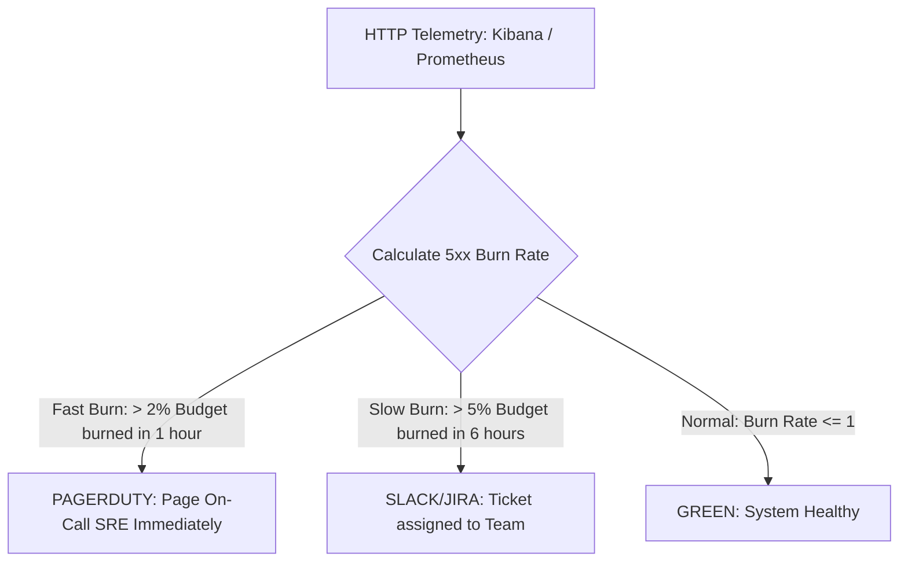

# Master SRE Guide: SLIs, SLOs, SLAs, Error Budgets & HTTP Status Code Engineering

This guide provides an end-to-end breakdown of **SLIs, SLOs, SLAs, Error Budgets**, and exact **HTTP Status Code Mapping** for Site Reliability Engineering (SRE) interviews and real-world AutoRABIT operations.

---

## 1. The Core Hierarchy: SLI ──► SLO ──► SLA

```
                  ┌────────────────────────┐
                  │          SLA           │  <-- Business / Legal Agreement (Financial Penalties)
                  ├────────────────────────┤
                  │          SLO           │  <-- Internal Target (Goal set by SRE + Product)
                  ├────────────────────────┤
                  │          SLI           │  <-- Real-Time Metric (Measured via HTTP status codes & latency)
                  └────────────────────────┘
```

| Term | Full Name | Definition | Who Cares? | Real-World Example |
| :--- | :--- | :--- | :--- | :--- |
| **SLI** | Service Level Indicator | Quantitative measure of real-time service performance. | SREs, Developers, Observability tools | *"99.94% of API requests returned HTTP 2xx/3xx in < 200ms over 30 days."* |
| **SLO** | Service Level Objective | Target agreed upon by SRE & Product teams. | SREs, Product Managers, Tech Leads | *"The service must maintain 99.9% success rate over a 30-day rolling window."* |
| **SLA** | Service Level Agreement | Contract specifying financial/legal penalties if SLO fails. | Customers, Legal, Executives, Sales | *"If monthly availability falls below 99.5%, customers get a 15% bill credit."* |

> 💡 **Golden Rule**: **$SLO > SLA$**. Your internal target ($SLO = 99.9\%$) must **always be higher** than your external contract ($SLA = 99.5\%$) so you have a safety cushion to fix issues before paying penalties.

---

## 2. HTTP Status Codes & SLI Classification

When calculating Availability SLIs, HTTP status codes must be strictly categorized into **Good Events**, **Bad Events (Error Budget Burners)**, and **Excluded Client Events**.

```
HTTP Requests Ingestion
       │
       ├──► 2xx / 3xx ─────────────────► [GOOD EVENT] ──► Counts towards SLI Success
       │
       ├──► 5xx (500, 502, 503, 504) ──► [BAD EVENT]  ──► BURNS ERROR BUDGET!
       │
       └──► 4xx (400, 401, 403, 404) ──► [EXCLUDED]   ──► Client Fault (Does NOT burn budget)
```

### Detailed HTTP Status Code Breakdown Table

| HTTP Status Code | Meaning | SLI Category | Impact on Error Budget | SRE / System Root Cause |
| :--- | :--- | :--- | :--- | :--- |
| **`200 OK` / `201 Created` / `204 No Content`** | Request Succeeded | **GOOD** | Increases SLI | Normal healthy application response. |
| **`301` / `302` / `304 Not Modified`** | Redirect / Cached | **GOOD** | Increases SLI | Normal redirection or browser cache hit. |
| **`400 Bad Request`** | Malformed Payload | **EXCLUDED** | **NO BURN** | Client sent invalid JSON/parameters. |
| **`401 Unauthorized` / `403 Forbidden`** | Auth Failure | **EXCLUDED** | **NO BURN** | Invalid API token or insufficient RBAC. |
| **`404 Not Found`** | Resource Missing | **EXCLUDED** | **NO BURN** | Client called wrong URL endpoint. |
| **`429 Too Many Requests`** | Rate Limited | **EXCLUDED / BAD** | **CONDITIONAL** | Excluded if client exceeds quota; counted as Bad if gateway throttles valid users. |
| **`500 Internal Server Error`** | App Crash / Unhandled | **BAD** | 🔥 **BURNS BUDGET** | Code exception, unhandled NullPointer, DB fail. |
| **`502 Bad Gateway`** | Upstream Unreachable | **BAD** | 🔥 **BURNS BUDGET** | Pod crashed (`CrashLoopBackOff`), Nginx/ALB cannot connect to backend. |
| **`503 Service Unavailable`** | Server Overloaded | **BAD** | 🔥 **BURNS BUDGET** | Pod CPU/RAM saturated, DB connection pool exhausted, queue full. |
| **`504 Gateway Timeout`** | Upstream Timeout | **BAD** | 🔥 **BURNS BUDGET** | Query execution timed out (>30s), downstream microservice hanging. |

---

## 3. Mathematical SLI Formulas with HTTP Status Codes

### A. Availability SLI Formula (Request-Based)

$$\text{Availability SLI} = \left( \frac{\text{Count of HTTP }(2xx + 3xx)}{\text{Total HTTP Requests} - \text{Count of HTTP }(4xx)} \right) \times 100$$

#### PromQL (Prometheus) Implementation:
```promql
# PromQL for 30-day Rolling HTTP Availability SLI
(
  sum(rate(http_requests_total{status=~"2..|3.."}[30d]))
  /
  sum(rate(http_requests_total{status=!~"4.."}[30d]))
) * 100
```

#### Kibana / Elastic (KQL) Filter:
```kql
# Good Events Filter
service.name: "autorabit-release-engine" AND http.response.status_code: [200 TO 399]

# Bad Events Filter (Error Budget Burners)
service.name: "autorabit-release-engine" AND http.response.status_code: [500 TO 599]
```

---

### B. Latency SLI Formula

Availability is not just "is it up?", but also "is it fast?".

$$\text{Latency SLI} = \left( \frac{\text{Count of HTTP Requests with status } \in [200-399] \text{ AND Latency} \le 300\text{ms}}{\text{Total Valid HTTP Requests (excluding } 4xx)} \right) \times 100$$

#### PromQL (Histogram) Implementation:
```promql
# 95th Percentile Latency SLI (< 300ms)
(
  sum(rate(http_request_duration_seconds_bucket{le="0.3", status=~"2..|3.."}[5m]))
  /
  sum(rate(http_request_duration_seconds_count{status=!~"4.."}[5m]))
) * 100
```

---

## 4. Error Budget Mechanics & Downtime Table

### Error Budget Formula:
$$\text{Error Budget} = 100\% - \text{SLO}$$

$$\text{Allowed Failed HTTP 5xx Requests} = \text{Total Valid Requests} \times (100\% - \text{SLO})$$

#### Real-World Example:
AutoRABIT processes **10,000,000 API requests** per month.
- Target SLO = **99.9%**
- Error Budget = **0.1%**
- **Allowed 5xx Errors** = $10,000,000 \times 0.001 = \mathbf{10,000\text{ failed requests}}$.
- If your system returns **10,001 HTTP 500 errors**, your Error Budget is **100% depleted (0% remaining)**.

### Allowed Downtime Reference Table (Monthly - 30 Days / 720 Hours):

| SLO Target | Error Budget (%) | Allowed Downtime per Month | Allowed Downtime per Year | Max 5xx Errors (per 10M Requests) |
| :--- | :--- | :--- | :--- | :--- |
| **99%** ("Two Nines") | `1.0%` | **7 hours, 12 minutes** | 3.65 days | 100,000 |
| **99.5%** | `0.5%` | **3 hours, 36 minutes** | 1.83 days | 50,000 |
| **99.9%** ("Three Nines") | `0.1%` | **43 minutes, 12 seconds** | 8.76 hours | 10,000 |
| **99.99%** ("Four Nines") | `0.01%` | **4 minutes, 19 seconds** | 52.56 minutes | 1,000 |

---

## 5. Why 100% Reliability is WRONG

As an SRE candidate, always emphasize:

> *"100% reliability is the wrong target for almost any application."*

1. **Exponential Cost**: Moving from 99.9% to 99.99% requires multi-region active-active clusters, complex consensus protocols, and 10x infrastructure expenditure.
2. **Client-Side Noise**: End-user mobile devices and internet ISPs fail 0.5% of the time anyway.
3. **Innovation Stagnation**: Without an Error Budget, teams cannot risk pushing new features, refactoring code, or updating Kubernetes node OS packages.

---

## 6. Burn Rate & Alerting Policies

**Burn Rate** measures how quickly HTTP 5xx errors consume your Error Budget.

$$\text{Burn Rate} = \frac{\text{Actual HTTP 5xx Rate}}{100\% - \text{SLO}}$$

```
Burn Rate = 1   ──► Budget consumed evenly over 30 days (Normal)
Burn Rate = 14.4 ──► Consumes 100% budget in 2 DAYS!  ──► [P1 PAGE ON-CALL]
Burn Rate = 72   ──► Consumes 100% budget in 10 HOURS! ──► [CRITICAL OUTAGE]
```

### Multi-Window Multi-Burn-Rate Alerting Rules:



- **Fast Burn Alert (P1 Urgent)**: Alert if **2% of monthly budget is burned in 1 hour** (Burn rate = 14.4). Page On-Call SRE via PagerDuty.
- **Slow Burn Alert (P2 Warning)**: Alert if **5% of monthly budget is burned in 6 hours** (Burn rate = 6). Notify team via Slack channel.

---

## 7. Error Budget Enforcement Policy (What happens at 0%?)

When HTTP 5xx errors exhaust the Error Budget (0% remaining), the automated **Error Budget Policy** kicks in:

```
             ┌────────────────────────────────────────────────────────┐
             │       Error Budget Exhausted (HTTP 5xx Rate > 0.1%)    │
             └───────────────────────────┬────────────────────────────┘
                                         │
                         ┌───────────────┴───────────────┐
                         ▼                               ▼
      ┌────────────────────────────────────┐ ┌────────────────────────────────────┐
      │   Automated Feature Freeze         │ │   100% Reliability Sprint          │
      │ • CI/CD non-emergency builds block │ │ • Sprint backlog shifts to:        │
      │ • Feature flags locked             │ │   - Fixing HTTP 500/502/504 errors │
      │ • Only hotfixes approved by SRE    │ │   - Scaling DB connection pools    │
      │   can be deployed                  │ │   - Adding circuit breakers        │
      └────────────────────────────────────┘ └────────────────────────────────────┘
```

1. **CI/CD Pipeline Lock**: GitHub Actions / CodePipeline blocks non-hotfix branches automatically.
2. **Reliability Sprint Pivot**: Developers stop new feature work and spend 100% of sprint capacity fixing root causes (e.g. adding PgBouncer for 503 DB errors, setting up Karpenter for 502 OOMKilled crashes).
3. **Unfreezing Rule**: Feature deployments resume ONLY when 30-day rolling budget restores above **20%**.

---

## 8. Real-World AutoRABIT Scenario Answer for Interviewers

### Question:
> *"How do you define SLIs using HTTP status codes, and what do you do when developers keep breaking the SLO?"*

### Model Answer:
> *"When defining Availability SLIs, I map HTTP response codes directly into Good, Bad, and Excluded events:
> - **Good Events**: HTTP 2xx and 3xx responses meeting latency thresholds (< 300ms).
> - **Bad Events**: HTTP 5xx errors—specifically `500` (code crashes), `502` (pod crashes/bad gateway), `503` (capacity overload), and `504` (database timeouts). These directly burn our Error Budget.
> - **Excluded Events**: HTTP 4xx client errors (`400`, `401`, `403`, `404`), as they represent client-side validation or auth failures, not platform unreliability.
>
> If developers are pushing releases that cause HTTP 5xx spikes and burn through the monthly Error Budget, our automated **Error Budget Policy** triggers a feature freeze in CodePipeline. The team pivots 100% of sprint capacity to reliability fixes—such as configuring PgBouncer for database connection timeouts or setting up Karpenter for EKS node autoscaling—until the rolling Error Budget recovers."*
